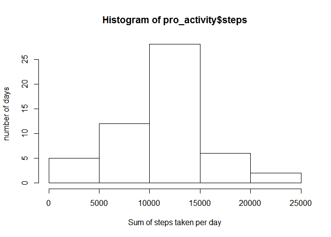
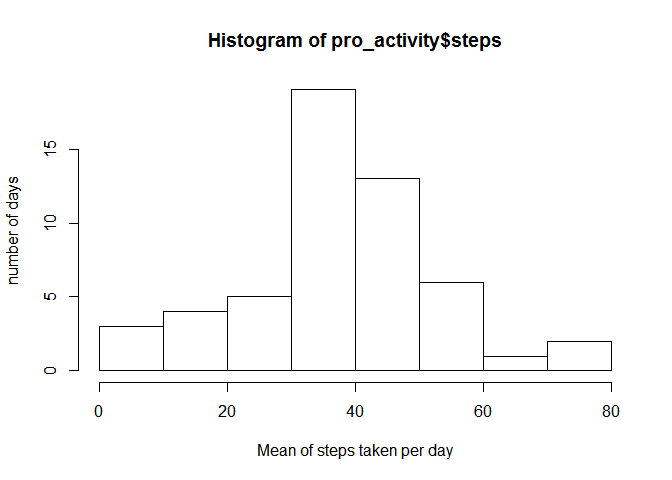
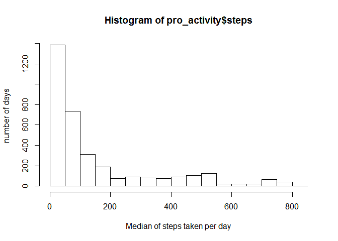
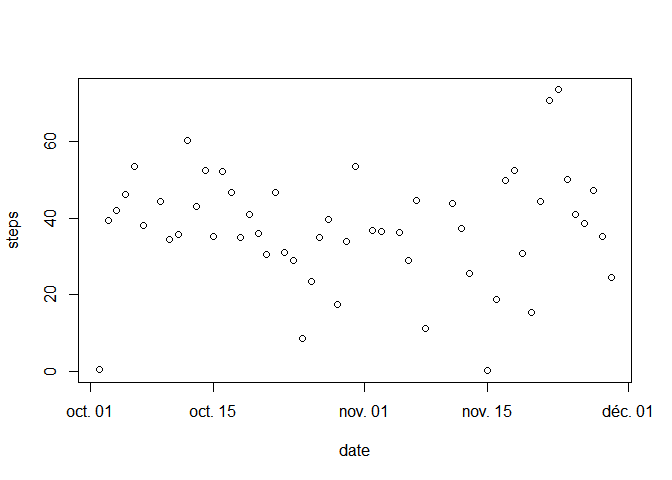
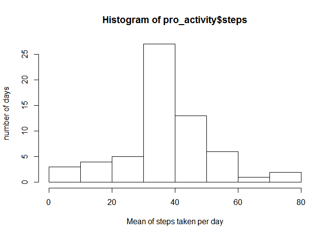
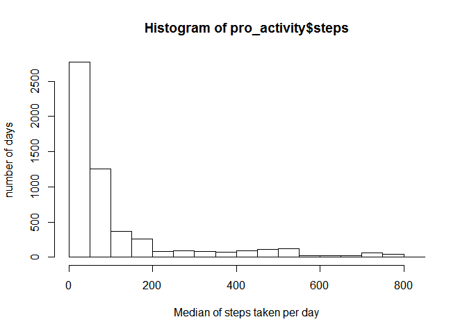
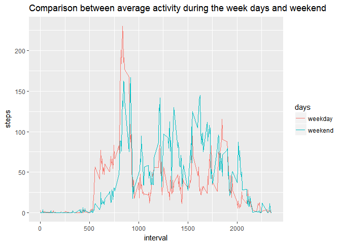

# PA1_template


Load data and convert the date field

```r
#read data from the activity.csv file and load it into activity 
        activity<-read.csv("activity.csv",header=TRUE,dec=".")
#convert date field to date format
        activity$date<-as.Date(activity$date)  
```
#Different plottings  
##Histogram of the total number of steps each day

```r
#histogram about sum of steps taken by day
        pro_activity<-aggregate(steps~date,activity,sum)
        hist(pro_activity$steps,xlab="Sum of steps taken per day",ylab="number of days") 
```

<!-- -->

##Histogram of the mean number of steps each day   

```r
 #histogram about mean of steps taken by day
        pro_activity<-aggregate(steps~date,activity,mean)
        hist(pro_activity$steps,xlab="Mean of steps taken per day",ylab="number of days")  
```

<!-- -->

##Histogram of the median number of steps each day

```r
#histogram about median of steps taken by day
       pro_activity<-aggregate(activity,by=list(activity$steps,activity$date),FUN=median,na.rm=TRUE)
        hist(pro_activity$steps,xlab="Median of steps taken per day",ylab="number of days")  
```

<!-- -->

##Time series plot of the average number of steps taken

```r
#time series based average step take per day
        pro_activity<-aggregate(steps~date,activity,mean)
        with(pro_activity,plot(date,steps))  
```

<!-- -->

##The interval that contains on average basis the maximum number of steps

```r
#The 5 min interval that, on average, contains the maximum of steps
        interval_activity<-aggregate(steps~interval,activity,mean)
        x<-interval_activity[interval_activity$steps==max(interval_activity$steps),1]  
```
###The 5 min-interval containing the maximum average value is 835  

##Imputting missing values  
After identying the rows containing steps with missing values. Creation of a new table with those missing values will be replaced by the average value of the corresponding interval.  

*Select NA values and store them in a data.table called test*


```r
#select NA values
test<- activity[is.na(activity$steps),]
```

*adapt in the test subset the interval so no more NA fields*

```r
#adapt in the test subset the interval so no more NA fields
 test[,1]<-interval_activity[test$interval==interval_activity$interval,2]
```

*cloning activity to new_activity and paste the result in the new activity data frame*

```r
#paste the result in the new activity data frame
new_activity<-activity
new_activity[is.na(new_activity$steps),1]<-test[new_activity$date==test$date & new_activity$interval==test$interval,1]
```

```
## Warning in `==.default`(new_activity$date, test$date): la taille d'un objet
## plus long n'est pas multiple de la taille d'un objet plus court
```

```
## Warning in new_activity$interval == test$interval: la taille d'un objet
## plus long n'est pas multiple de la taille d'un objet plus court
```

##Histogram of the total number of steps each day after missing values imputted

```r
#histogram about sum of steps taken by day
        pro_activity<-aggregate(steps~date,new_activity,sum)
        hist(pro_activity$steps,xlab="Sum of steps taken per day",ylab="number of days") 
```

<!-- -->

##Histogram of the mean number of steps each day after missing values imputted

```r
#histogram about sum of steps taken by day
        pro_activity<-aggregate(steps~date,new_activity,mean)
        hist(pro_activity$steps,xlab="Mean of steps taken per day",ylab="number of days") 
```

<!-- -->

##Histogram of the median number of steps each day after missing values imputted

```r
#histogram about sum of steps taken by day
       pro_activity<-aggregate(new_activity,by=list(new_activity$steps,new_activity$date),FUN=median,na.rm=TRUE)
       hist(pro_activity$steps,xlab="Median of steps taken per day",ylab="number of days")
```

<!-- -->

*Filling the NA values made figures higher*  


*To compare weekdays and weekend activity let's create 2 temporary table frame one for weekdays and the other for weekends*


```r
#load the dplyr library because needed now
library(dplyr)
```

```
## 
## Attaching package: 'dplyr'
```

```
## The following objects are masked from 'package:stats':
## 
##     filter, lag
```

```
## The following objects are masked from 'package:base':
## 
##     intersect, setdiff, setequal, union
```

```r
#creation of weekends table
we_activity<-new_activity%>%filter(weekdays(date)=="samedi"|weekdays(date)=="dimanche")%>%mutate(weekend="Weekend")

#creation of weekdays table
wd_activity<-new_activity%>%filter(weekdays(date)!="samedi"& weekdays(date)!="dimanche")%>%mutate(weekend="Weekday")

#creation of aggregate tables for weekends and weekdays
wd_activity<-aggregate(steps~interval,wd_activity,mean)
we_activity<-aggregate(steps~interval,we_activity,mean)

#merge data into total_activity
we_activity<-we_activity%>%mutate(days="weekend")
wd_activity<-wd_activity%>%mutate(days="weekday")
total_activity<-rbind(wd_activity,we_activity)

#plot result
library(ggplot2)
```

```
## Warning: package 'ggplot2' was built under R version 3.3.3
```

```r
ggplot(data=total_activity,aes(x=interval,y=steps,colour=days))+ggtitle("Comparison between average activity during the week days and weekend")+geom_line()
```

<!-- -->


